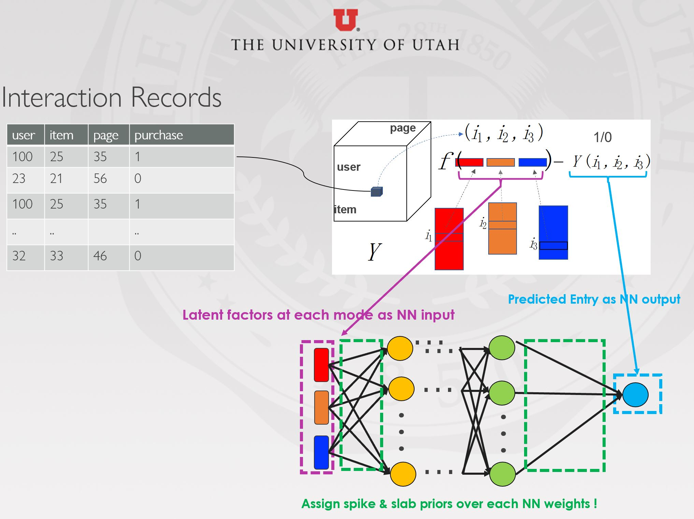

# Streaming-Bayesian-Deep-Tensor

by Shikai Fang, Zheng Wang, Zhimeng Pan, Ji Liu, Shandian Zhe

code for paper : Streaming Bayesian Deep Tensor Factorization for ICML 2021

Links for [Paper](http://proceedings.mlr.press/v139/fang21d/fang21d.pdf) and [Supplementary](http://proceedings.mlr.press/v139/fang21d/fang21d-supp.pdf)




## Requirements:
This project is implemented based on the framework of [Probabilistic-Backpropagation](https://github.com/HIPS/Probabilistic-Backpropagation) (  [Paper](https://arxiv.org/abs/1502.05336)), which applies the Theano and python 2.7. Please find the requirement details in PBP project, make sure you insatll Theano and can run the PBP bug-free. 

## Instructions:
1. Clone this repository.
2. See model details in `SBDT_net\` .  Run model with `$ python SBDT_datasetname.py`

## Datasets & Baselines
We offer three large size tensor dataset for test.
Binary-data dataset: Anime at  `.\stream_nn_td_binary\data_binary\anime`
Real-data dataset: Acc at  `.\stream_ss_td_real\data_real\acc` and Movilens1M at `.\stream_ss_td_real\data_real\movielens_1m` 

Check our paper for more datasets and baselines.

## Citation
Please cite our work if you would like it
```
@inproceedings{fang2021streaming,
  title={Streaming Bayesian Deep Tensor Factorization},
  author={Fang, Shikai and Wang, Zheng and Pan, Zhimeng and Liu, Ji and Zhe, Shandian},
  booktitle={International Conference on Machine Learning},
  pages={3133--3142},
  year={2021},
  organization={PMLR}
}

```

